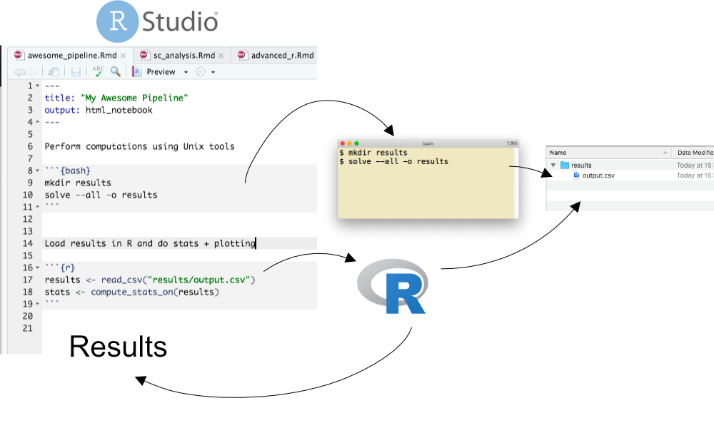
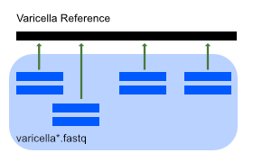
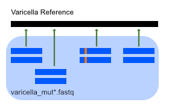
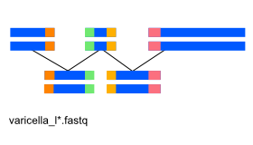

# Learning Outcomes

- Develop reproducible computational procedures using R notebooks.
- Work with conda environments.
- Run sequence processing software via command-line interfaces.
- Run wrapper R libraries to manage and execute sequence workflows.


# Initial setup: Work environment and Data

To connect to the terminal use `ssh 129.16.45.154` connect with studentX and password, where is is your designated student number that you will find in KEATS.
Before we begin from you browser open http://129.16.45.154:8787 login with the same credentials.


The starter notebook contains instructions for setting up your conda
environment and R tidyvese package that is needed to interpret R notebooks. 
Please follow these instructions, then continue using
the notebook to write the commands used here and take notes for the exercises.
You can also download a copy from [here](sequencing_technologies_tutorial.Rmd) for your own computer. 

The notebook that will serve as both a rudimentary pipeline and final (reproducible) report.




If you have not done so already, you need to first install conda.
See instructions [here](../unix/conda_install.html)

## Directory and data setup
We will be working in RStudio and primarely writing the commands in this notebook. However, the first commands in this section is easier if you run from the terminal. 


Please create a directory for this tutorial in your home directory and inside there
copy the starter notebook from my directory. To do this run the following commands in the terminal after logging on to the server.

```bash
mkdir NGS_Tutorial
cd NGS_Tutorial
wget https://raw.githubusercontent.com/zelezniak-lab/7BBG1002/refs/heads/main/seq_tech/sequencing_technologies_tutorial.Rmd 

```

Now fetch a copy of the data we will be using:

```bash
wget https://raw.githubusercontent.com/zelezniak-lab/7BBG1002/refs/heads/main/seq_tech/data.zip 
unzip data.zip
```

To nicely see the contents of (small) directories, you can use
the `tree` program, but you need to install it first (`conda install -c conda-forge tree`)

```bash
tree data
```

You can also run `ls *` (which works on any system)

To make sure this data is protected from accidental writes, 
remove the write permission (`-w`) for anyone on the server (`ugo`) 
on it by running:

```bash
find data -type f -print0 | xargs -0 chmod ugo-w
```

Then create results directory

```bash
mkdir results
```


## Work environment 


It's standard practice to create a new conda environment for each project.
This is because each project may require a number of different software packages,
with certain version. Even if these requirements are very similar between the projects,
even small differences may topple the house of cards that is the software ecosystem.
This is officially referred to as ["dependency hell"](https://en.wikipedia.org/wiki/Dependency_hell)
an can be traumatizing.

Conda can fetch packages from many different sources (aka "channels")
Let's add the Bioconda channel, as well as the general-purpose conda-forge.
("defaults" is given first to give it top priority when searching for packages)

Ignore the errors about " Inappropriate ioctl for device" 
and "no job control in this shell". They're a harmless consequence of this.

```{bash, eval=FALSE}
conda config --add channels defaults
conda config --add channels bioconda
conda config --add channels conda-forge
```

Create and activate a new environment for this exercise. 
The conda create command create new environments, the option --name specifies the name of your new environment and the option -y lets conda know that you answer yes to all prompts. Without -y you will have to manually type in yes when prompted.
The command conda activate activates the environment within the current code chunk **and only the current code chunk**. Which means that within every code chunk that we want to use our environment we need to first run conda activate <environment_name>. 

```{bash, eval=FALSE}
conda create --name sequencing -y
source ~/.bashrc 
conda activate sequencing
```
If that still doesn't work, please ask for help so we make sure we all start from the same place.

Now install the software needed for this exercise. We want to install the software on to our new environment so we first activate the environment with conda activate.
The command conda install will install the packages that you specify to it. You can specify multiple packages at a time by separating them with spaces. This step will also ask for confirmation if we do not specify the -y option. 
Later on / in real life, it's good to to examine what changes are made when installing new packages. You can easily view all the packages installed in an environment by running conda list once activated. 

**Make sure you activated the `sequencing` environment!**

```{bash, eval=FALSE}
conda activate sequencing
conda install samtools bowtie2 breseq abyss bcftools wgsim emboss tree -y
```
Lets inspect the packages that we just installed.
```{bash, eval=FALSE}
conda activate sequencing
conda list
```


Run the code chunk below to enable running conda commands from this notebook.
For future reference, this functionality is achieved with `knitr` package which is a part of `tidyverse`                                                  
[knitr](https://yihui.org/knitr/options/) package.

Before proceeding go back to R console and install missing tidyverse package, this is needed to Run notebooks, i.e. by default knitr might be missing.

# Exercise 1: Alignment


~~~r
```{r, setup}
install.packages(setdiff(c("tidyverse", "geneviewer"), rownames(installed.packages())))
knitr::opts_chunk$set(engine.opts = "-i")
```
~~~

We'll be aligning sequencing data against the reference genome of a Varicella virus.




But first lets take a look at the Varicella genome
~~~r
```{r, eval=FALSE}
library(geneviewer)

gff_file <- "data/ref/varicella.gff"      # small genome annotation
fasta_file <- "data/ref/varicella.fasta"  # reference sequence 

gff <- read_gff(gff_file) %>% filter(type == "CDS")

GC_chart(
  gv,
  start   = "start",
  end     = "end",
  strand  = "strand",
) %>%
  GC_title("Varicella genome (CDS)") %>%
  GC_clusterLabel() %>%              # label the track
  GC_scale(axis_type = "range") %>%  # show full range (handy for size context)
  GC_genes(group = "gene",           # colour/group by feature name (or product)
           stroke = "none",
           marker_size = "small") %>%
  GC_labels(label= "gene",
            adjustLabels = TRUE,
             show = TRUE,
            fontSize = "5px",)
            
```
~~~


This mainly involves using `bowtie2` to align short-read sequencing data to the reference genome and 
`samtools` to post-process and visualize the result:

Raw data files:

- Varicella reference genome: `data/ref/varicella.gb`
- Sequencing files: `data/seq/varicella1.fastq`, `data/seq/varicella2.fastq`

You can run the commands in the terminal directly to test them out, but they should be included (in order) in the R notebook, so copy the code chunks 
(including the surrounding `{bash}` marker) and run the chunk from the notebook.

**! NOTE !** Make sure to put curly braces `{ }` around `bash` and `r`.
These disappear when this webpage is created for some reason...

## Protocol

### Step 1: Init

Create a separate results dir

~~~bash
```{bash, eval=FALSE}

mkdir results/exercise1
```
~~~

### Step 2: Preprocess

`bowtie2` requires an index file for the reference sequence.
This index can only be constructed from a FASTA file but it's common practice to
find reference genomes in GenBank (GFF3) format.

Convert `varicella.gb` to FASTA using the 
[seqret](http://emboss.sourceforge.net/apps/cvs/emboss/apps/seqret.html) converter from the EMBOSS package,
then build the bowtie index accordingly.

> (Computation time: seconds)

~~~bash
```{bash, eval=FALSE}
source ~/.bashrc 
conda activate sequencing

# Convert GFF3 > FASTA
seqret -sequence data/ref/varicella.gb -feature -fformat gff3 -osformat fasta data/ref/varicella.fasta

# This file is outptut by seqret in the current directory (because bad design)
# So we move it where it belongs
mv varicella.gff data/ref/

# Document how the FASTA file was created
echo "vaircella.fasta converted from GFF as:" > data/ref/README.txt
echo "seqret -sequence data/ref/varicella.gb -feature -fformat gff3 -osformat fasta data/ref/varicella.fasta" >> data/ref/README.txt

# Save index files in own directory
mkdir results/exercise1/bowtie_index
# Build the bowtie2 index
bowtie2-build -f data/ref/varicella.fasta results/exercise1/bowtie_index/varicella
```
~~~


### Step 3: Align sequences to reference

Align the sequencing data to the reference genome using `bowtie2`.
This will create the file `varicella.sam`
The `\ ` symbol simply breaks the command across multiple lines for readability.

> (Computation time: 1 min)

~~~bash
```{bash, eval=FALSE}
source ~/.bashrc 
conda activate sequencing

mkdir results/exercise1/alignment
bowtie2 -x results/exercise1/bowtie_index/varicella \
	-1 data/seq/varicella1.fastq -2 data/seq/varicella2.fastq \
	-S results/exercise1/alignment/varicella.sam
```
~~~


### Step 4: Convert alignment to binary format

To make reading the alignment info easier for the computer,
convert the sequence alignment map (SAM) file to binary alignment map (BAM)
using the `samtools` `view` command:

> (Computation time: seconds)

~~~bash
```{bash, eval=FALSE}
source ~/.bashrc 
conda activate sequencing

samtools view -b -S -o results/exercise1/alignment/varicella.bam \
    results/exercise1/alignment/varicella.sam
```
~~~


### Step 5: Optimize alignment (pt 1)

To optimize the lookup in the alignment map,
sort the BAM file using `samtools sort` command.
This will create the file `varicella.sorted.bam`

> (Computation time: seconds)

~~~bash
```{bash, eval=FALSE}
source ~/.bashrc 
conda activate sequencing

samtools sort results/exercise1/alignment/varicella.bam -o \
    results/exercise1/alignment/varicella.sorted.bam
```
~~~


### Step 6: Optimize alignment (pt 2)

To speed up reading the BAM file even more,
index the sorted BAM file using `samtools` `index` command:

> (Computation time: seconds)

~~~bash
```{bash, eval=FALSE}
source ~/.bashrc 
conda activate sequencing

samtools index results/exercise1/alignment/varicella.sorted.bam
```
~~~

This will create a BAI file called `results/exercise1/alignment/varicella.sorted.bam.bai`


### Step 7: Calculate alignment coverage

Calculate the average coverage of the alignment using the `samtools depth` command
and the Unix `awk` text processor to extract the values of interest:

> (Computation time: 1s)

~~~bash
```{bash, eval=FALSE}
source ~/.bashrc 
conda activate sequencing
samtools depth results/exercise1/alignment/varicella.sorted.bam | awk '{sum+=$3} END {print "Average = ", sum/124884}'
```
~~~

Output should be: `Answer: average =  199.775`


## Question

Use the `samtools depth` command to extract coverage info 
and create a coverage map of the genome (position vs. coverage).
Read the help for the tool with `samtools help depth`. 
The output format is described at the end of the help.
 
Answer: 

~~~bash
```{bash, eval=FALSE}
source ~/.bashrc 
conda activate sequencing
samtools depth results/exercise1/alignment/varicella.sorted.bam > results/exercise1/alignment/coverage.tsv
```
~~~

Plot the result with R

~~~r
```{r, message=F, eval=FALSE}
library(tidyverse)

alignment_coverage <-
  read_tsv('results/exercise1/alignment/coverage.tsv',
           col_names = c("reference_name", "position", "coverage_depth"))

alignment_coverage %>% 
  ggplot() + geom_histogram(aes(x = coverage_depth))
```
~~~


# Exercise 2: Finding Mutations with SAMtools

We now look at a second set of sequencing data, with mutations (`data/seq/varicella_mut1.fastq` and `data/seq/varicella_mut1.fastq`)



We'll still be using `bowtie2` and `samtools` to perform these tasks,
however we'll be doing structuring all the steps in to one script.

This approach has the great advantage that we don't need to copy-paste all we did above just to change the name of the input files. That's cumbersome and *very* error-prone. Instead we just need to change the file name at one location.

## Protocol


### Step 1: Align sequences to reference

Create a sorted and indexed BAM file using the code below, which encapsulates steps 2-6 from Exercise 1 (except for the GFF > FASTA conversion).

~~~bash
```{bash, eval=FALSE}
source ~/.bashrc 
conda activate sequencing

DATA_DIR=data/seq
RESULT_DIR=results/exercise2

REFERENCE_GENOME=data/ref/varicella.fasta
READS_1=$DATA_DIR/varicella_mut1.fastq
READS_2=$DATA_DIR/varicella_mut2.fastq


BOWTIE_INDEX_DIR=$RESULT_DIR/bowtie_index
ALIGNMENT_DIR=$RESULT_DIR/alignment

# Make all directories
mkdir $RESULT_DIR
mkdir $BOWTIE_INDEX_DIR
mkdir $ALIGNMENT_DIR

# Build the bowtie2 index
bowtie2-build -f $REFERENCE_GENOME $BOWTIE_INDEX_DIR/varicella


bowtie2 -x $BOWTIE_INDEX_DIR/varicella \
	-1 $READS_1 -2 $READS_2 \
	-S $ALIGNMENT_DIR/varicella_mut.sam
	
samtools view -b -S -o $ALIGNMENT_DIR/varicella_mut.bam \
    $ALIGNMENT_DIR/varicella_mut.sam
    
samtools sort $ALIGNMENT_DIR/varicella_mut.bam -o \
    $ALIGNMENT_DIR/varicella_mut.sorted.bam
    
samtools index $ALIGNMENT_DIR/varicella_mut.sorted.bam

```
~~~

Tip: Run `ls -l data/*` to `tree data` if you forget what files you're working on.

The workflow will also create `results/exercise2` for you.

> (Computation time: 5 minutes)


### Step 2: Identify point mutations

Use the `bcftools mpileup` command to identify genomic variants 
(aka single nucleotide variants, [SNVs](https://en.wikipedia.org/wiki/SNV_calling_from_NGS_data))
in the alignment. This will create the file `varicella_variants.bcf`

~~~bash
```{bash, eval=FALSE}
source ~/.bashrc 
conda activate sequencing

bcftools mpileup -f data/ref/varicella.fasta results/exercise2/alignment/varicella_mut.sorted.bam > results/exercise2/varicella_variants.bcf
```
~~~

### Step 3: Inspect mutations (pt 1)

Use `bcftools call` command to convert the binary call format (BCF) to 
(human-readable) variant call format ([VCF](https://en.wikipedia.org/wiki/Variant_Call_Format)).
 This will create the file `varicella_variants.vcf`

~~~bash
```{bash, eval=FALSE}
source ~/.bashrc 
conda activate sequencing

bcftools call -c -v results/exercise2/varicella_variants.bcf > results/exercise2/varicella_variants.vcf
```
~~~

If you wish to inspect it, run `less -S results/exercise2/varicella_variants.vcf`
The file contains quite a lot of information, which we'll use later on.
See https://en.wikipedia.org/wiki/Variant_Call_Format for more info.

### Step 4: Inspect mutations (pt 2)

Visualize the mutation detected on site `77985` using the `samtools tview` command.
For this, you only need the BAM file. Remember that this files stores mutant-to-reference alignment information.
VCF (and BCF) contain only the information needed for some downstream tasks.

This is an interactive command so **run it in the terminal**:

```{bash, eval=FALSE}
source ~/.bashrc 
conda activate sequencing

samtools tview results/exercise2/alignment/varicella_mut.sorted.bam \
    data/ref/varicella.fasta -p NC_001348:77985 
```


## Questions

### Q1

Inspect the VCF file columns using the Unix command chain:

```{bash, eval=FALSE}
grep -v "^#"  results/exercise2/varicella_variants.vcf | column -t | less -S
```


(Chain: Filter out header | align columns | show on screen)

How can you interpret the [PHRED](https://en.wikipedia.org/wiki/Phred_quality_score) 
score values in the last column? 
See [What is a VCF and how should I interpret it?](https://gatkforums.broadinstitute.org/gatk/discussion/1268/how-should-i-interpret-vcf-files-produced-by-the-gatk) (Section 5)

Are all mutations homozygous? Should you expect any heterozygous mutations in this case?

### Q2

What assumption does `samtools mpileup` make about the model of genetic mutations?
(Try running `bcftools mpileup` for help and scroll down.) 
Is this model appropriate for a virus?

Answer: 
<font color="white">
samtools mpileup assumes the data originates from a diploid organism
and models mutations based on the existence of two similar copies of the same sequence.
Since viruses only have one copy of the genome, this model is not correct and 
it is not possible for a single genomic position to have two different bases.
</font>

### Q3

Use `samtools mpileup` to inspect the site 73233. What is the frequency of each base on this site?
Rune the command below and see [Pileup format](https://en.wikipedia.org/wiki/Pileup_format)

~~~bash
```{bash, eval=FALSE}
source ~/.bashrc 
conda activate sequencing

samtools mpileup -r NC_001348:73233-73233 -f data/ref/varicella.fasta \
    results/exercise2/alignment/varicella_mut.sorted.bam
```
~~~

Answer:  <font color="white"> 170 T, 1 A, 2 G </font>


# Exercise 3: Finding Mutations with breseq

Using the `breseq` pipeline to compute the mutations present in the mutant strain 
in comparison to the reference sequence provided for the varicella virus.


## Protocol

### Step 1: Init

Create the results directory for this exercise:

~~~bash
```{bash, eval=FALSE}
mkdir results/exercise3
```
~~~

### Step 2: Run

> (Computation time: 5 minutes)

Run `breseq`

~~~bash
```{bash, eval=FALSE}
source ~/.bashrc 
conda activate sequencing
breseq -j 1 -o results/exercise3 \
    -r data/ref/varicella.gb data/seq/varicella_mut*.fastq
```
~~~


## Questions

### Q1

Open the `index.html` file in the `results/exercise3/output` folder 
(Using the File tab in RStudio, navigate to the file, click on it, and choose "Open in browser")
and compare the mutations detected, in comparison to exercise 2. 

Answer: One mutation is missing in breseq

### Q2

Use the `breseq bam2aln` command to investigate the missing mutations

Answer: 

~~~bash
```{bash, eval=FALSE}
source ~/.bashrc 
conda activate sequencing

breseq bam2aln \
    -f data/ref/varicella.fasta \
    -b results/exercise2/alignment/varicella_mut.sorted.bam \
    -r NC_001348:117699-117699 -o results/exercise3/missing_mutations.html
```
~~~

Now open the output `results/exercise3/missing_mutations.html` with RStudio.
Breseq missed this mutation in the output table.

### Q3

Open the `results/exercise3/output/summary.html` file and find the mean coverage of the alignment.
Find also the coverage plot.


# Exercise 4: De novo genome assembly

So far we've been using a reference genome to align reads to it.
When one is not available, the genome has to be assembled *de novo* from the reads.
Here, we'll be using the `abyss` assembler with reads from the *dumas* strain of the varicella virus.



Sequencing files from *dumas* strain: `data/varicella_l1.fastq`, `data/varicella_l2.fastq`

## Protocol


### Step 1: Init

~~~bash
```{bash, eval=FALSE}
mkdir results/exercise4
```
~~~

### Step 1: Assembly

Assemble the reads provided into a genome using `abyss-pe` for `k=128`

> (Computation time: 5 minutes)

~~~bash
```{bash, eval=FALSE}
source ~/.bashrc 
conda activate sequencing

abyss-pe name=varicella k=128 --directory=results/exercise4 \
    in='../../data/seq/varicella_l1.fastq ../../data/seq/varicella_l2.fastq'
```
~~~


## Questions

### Q1

How many unitigs, contigs and scaffolds were assembled?

Hint: `less varicella-stats.md`

Answer: <font color="white">14, 12, 6</font>

### Q2

How big is the largest scaffold?

Answer: <font color="white">107578</font>

### Q3

Use NCBI nucleotide blast (https://blast.ncbi.nlm.nih.gov/Blast.cgi) 
to find similar sequences to the scaffolds obtained. 
What is the most similar sequence obtained?
